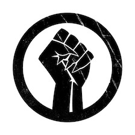
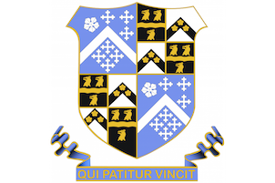
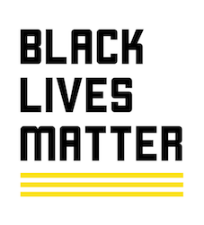
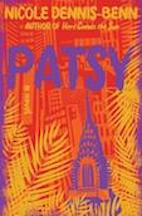
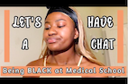

<html>
<head>
<title> Updates and English/History Resources</title>
</head>
<body style="background:$blue-300	#79b8ff">
 

  <h1>Student/Teacher Updates about BLM and Subject Resources!</h1>

 
 
<h3> ! More Compatible on Laptop Devices than Phones ! </h3>

Hi, this is a website dedicated for Latymer students to be provided with information in a more efficient and clearer way. This is from an educational point of view where there are resources, articles and information available. As well as being a forum for people to be informed and understand  history that the curriculum does not cover BME/BIPOC history. We aim to keep the momentum going and hopefully whilst being in lockdown, you can still educate yourself further and become a better ally.

 <h3 style="background-color:purple">If you have any suggestions or discussion points (History/English POV) that you would like posted on this website, press <a href="https://forms.gle/Xx7cKgC1nFo96DJcA">here</a> to fill out the form.</h3>

<h3> Also, this is a forum for all students and teachers, so, if you would like to add something to this website then please send the document or resource <a href="mailto:y14tiche@latymer.co.uk">here</a></h3>

If you want to write a blog or check out petitions and email templates, then go check out Zahra's BAME LDN page <a href="https://zahra-rahman.github.io/BAME_LDN/">here!</a>

<h1 style="background-color:Yellow"> Updates! </h1>

Thanks to Ms Elia for the novels recommendations, by Black Female Authors!

       

Click <a href="https://www.goodreads.com/book/show/36586697-queenie?from_search=true&from_srp=true&qid=tM9dAvt1F3&rank=1">here</a> to read about Queenie!    

Clich <a href="https://www.goodreads.com/book/show/41817523-patsy">here</a> to read about Patsy!

<a href="https://drive.google.com/drive/u/2/folders/1EV4pLH9iv3edDVYOJpDYLmLFhryk7IhU">Updates Archive</a>

<h1 style="background-color:lightpink"> Newsletter</h1>
<a href="https://drive.google.com/drive/folders/1E03SWB68L_ejIOb-b9JTyMqR2fGh8NYy?usp=sharing">"Solidarity with BLM"</a>

 <h1 style="background-color:lightpink">Within School Updates: How to be engaged</h1>
- ACS society are in the process of creating a BLM board for the Great Hall, although it is a way to appreciate and commemorate Black Men and Women's history and work, we believe it shouldn't stop there. So please try to educate yourself, and look at the resource pages below. 

- As changing the curriculum is an ongoing discussion, it is a long term process, so the English as well as History department are looking for ways to incorporate educating students whether that be through extra curriculum or on a student's own accord.

- If you would like to be apart of an open discussion based on History that isn't taught in the curriculum, <a href="mailto:y14tiche@latymer.co.uk">press this email<a/> and let us know and you will be added to a google classroom.

- Please keep updated with this website as well as Zahra's in the link above, I will keep updating so that your emails won't be spammed and can be a better way to take in information! 

<h1 style="background-color:lightpink">Justice For !</h1>

<ul>
 <li class="Box-row">
  
<h3> Elijah Mcclain</h3>

 
<a href="https://linktr.ee/Justiceforelijahmcclain">Elijah's Resource Card</a>

 <li class="Box-row">
  
<h3> FIGHT FOR YEMEN </h3>

 
<a href="https://linktr.ee/Freddie.Gandy">Yemen Resource Card</a>

 <li class="Box-row">
  
<h3> Justice for Breonna Taylor and countless others</h3>

<a href="https://linktr.ee/acab">Resource Card</a>

 <li class="Box-row">
 
<h3> SHRUKI ABDI</h3>

 
<a href="https://linktr.ee/sagalmuse">Shruki's Resource card </a>

<h1 style="background-color:lightpink"> Resources to educate yourself and family!</h1>

<a href="https://drive.google.com/drive/folders/1dU3gRzrGuDZfdQ9X-e-T4w0WPAQAudki?usp=sharing">Resource List of Books/Films</a>

<a href="https://literacytrust.org.uk/resources/black-lives-matter-book-lists-ages-0-16/?mc_cid=8ea2999360&amp;mc_eid=917a23e4d4">Reading Books ages 0-16+</a>

If you have parents who might not understand what's going on with BLM, or cannot understand English as well as you can, here is a link for pre-written letters written in multiple languages that might help them understand more. <a href="https://lettersforblacklives.com/2020/home">Letters For Black Lives</a>

 A lot of us, students and teachers, might not know our rights. Check this website, <a href="https://www.gov.uk/police-powers-to-stop-and-search-your-rights">learn your rights</a>

Feeling overwhelmed? Make sure to take care of yourself physically and mentally. Young Minds has a great 24/7 Crisis Messenger service where anyone can text a trained volunteer. Check their website for networks that allow you to text them for free <a href="https://youngminds.org.uk/find-help/get-urgent-help/youngminds-crisis-messenger/">here.</a> Text 'YM' to 85258. 

<h1 style="background-color:lightpink">Extra English: But Through The Eyes of...</h1>
<embed src="The Tempest - Caliban.pdf" width="400px" height="600px"/>

<h1 style="background-color:lightpink">Literary Magazine Updates!</h1>

Maisie and Rojbin in Year 12 have created a literary magazine: Euphrasia. They'll be publishing new issues monthly, full of books we've read as well as interesting articles and podcasts.

This month's issue (below) focuses on Black Lives Matter: we've reviewed both fiction and non-fiction, written by black authors.

July's theme will be 'London'. Details on contributing are at the end of the issue.

<embed src="Euphrasia.pdf" width="500px" height="700px" />

<h1 style="background-color:lightpink">Articles written by Students to Read</H1>
<embed src="MEDICINE, racism in healthcare.pdf" width="500px" height="700px" />

<h1 style="background-color:lightpink">"Think About History Now and Then"</h1>

<embed src="Mary Seacole and Florence Nightingale.pdf" width="400px" height="600px"  />     <embed src="Windrush gen.pdf" width="400px" height="600px" />

<h2>Extra Fact Files To Read <a href="https://drive.google.com/drive/folders/1WNfUH2is9YHAPXOEV78Ou9-7mDPmdsBx?usp=sharing">here!</a></h2>

<h1 style="background-color:lightpink">Competitions or Other Activities</h1>

Check out:

<a href="https://www.100greatblackbritons.co.uk/competition.html?fbclid=IwAR1z26m5zKbCBM30Y9BEp4Ih-YgBq17488IuQMe-bNGL0uUUG1ictNjHsdQ#children16">100 Great Britons!</a>

Sign these open Parliament Petitions <a href="https://petition.parliament.uk/petitions?state=open">Here!</a>

Catch up on Modern Black Poets podcasts <a href="https://www.bbc.co.uk/programmes/b006qp7q">BBC 4</a>

 
          

<h3>Interested in Modern Poetry?</h3>        

Click below for recommendations
          

 of great Poets tackling racism and race within Poetry 
          

  <ul>
    <li class="Box-row">
    <a href="https://www.youtube.com/watch?v=VfZjScrrrME">Roger Robinson</a>
   </li>
    <li class="Box-row">
     <a href="https://m.youtube.com/watch?v=-Q9i8FjR7QQ">Anthony Anaxagorou 1</a> 
   </li>
   <li class="Box-row">
     <a href="https://m.youtube.com/watch?v=qXohqBX9xck">^Part 2</a>
    </li>
    <li class="Box-row">
     <a href="https://www.youtube.com/watch?v=ZLjYflvXYIM">Langston Hughes</a>   
   </li>
     <li class="Box-row">
     <a href="https://www.waterstones.com/book/poor/caleb-femi/2928377038588?awc=3787_1592601048_4ebf6c66e64684228cc8f26804b0ac9f&utm_source=101248&utm_medium=affiliate&utm_campaign=adgoal">Caleb Femi 'Poor' Novel 
    <li class="Box-row">
     <a href="https://www.youtube.com/watch?v=JqOqo50LSZ0&list=PLY7YrMlggULHyUiruF4tQ_NXRsoY7-ECe">Maya Angelou</a>
    </li>
    <li class="Box-row">
     <a href="https://www.youtube.com/watch?v=WWJjd87Ldrw">Jamilia Woods</a>
    </li>
    <li class="Box-row">
     <a href="https://www.youtube.com/watch?v=ivhacww-EMc">Caleb Femi</a>
   </li>
    <li class="Box-row">
     <a href="https://www.youtube.com/watch?v=gdjQ0qN6Oxo">Malika Booker</a>
   </li>
    <li class="Box-row">
     <a href="https://www.youtube.com/watch?v=Tv-6Gy0jKjw">Linton Kwesi Johnson</a>
   </li>
    <li class="Box-row">
     <a href="https://www.youtube.com/watch?v=aBnX_iQbXvg">Mary Jean Chan</a>  

<h1 style="background-color:lightblue">Keep Up Wtih Socials</h1>
     

 <h4>JOURNEY 2 MED</h4>
 <h4>Aspiring Medics? Follow <a href="https://www.instagram.com/journey.2.med/">@journey.2.med</a> on insta/youtube</h4>

Press the Pic below and check out their vid

'Being Black At Medical School - My Experience'

 <h4>ACS LATYMER</h4>
 <h4>Follow <a href="https://www.instagram.com/latymer_acs/">@latymer_acs</a> ~ This Month's Theme Is Mowtown.</h4>
 
'A student-led instagram page run by members of the Afro-Carribean Society (ACS) helping to educate the Latymer school community on black history, art, music and culture. The page contains book recommendations as well as netflix series, films, documentaries and youtubers that we ourselves have watched and would recommend as a way of learning about black figures and history that shape our society. In addition, we address current political issues affecting our community and try to stimulate constructive discussion in order to better our own school environment. We really hope that this page can act as a source of positive representation for students in the school in order to push black excellence to the forefront and redefine race narratives in our own small way'~ Lola
 

 <h4>BAME LDN</h4>
 
Check Out Zahra's Website

 
Has petitions and resources

 
Click <a href="https://zahra-rahman.github.io/BAME_LDN/">here</a> to see the website!

  
Press the picture below to follow their instagram page

  

 <h4>SYSTEMIC RACISM</h4>
 
<h4>Need help understanding/explaining</h4>

Systemic Racism? check out this <a href="https://www.youtube.com/watch?v=YrHIQIO_bdQ">clip</a>

